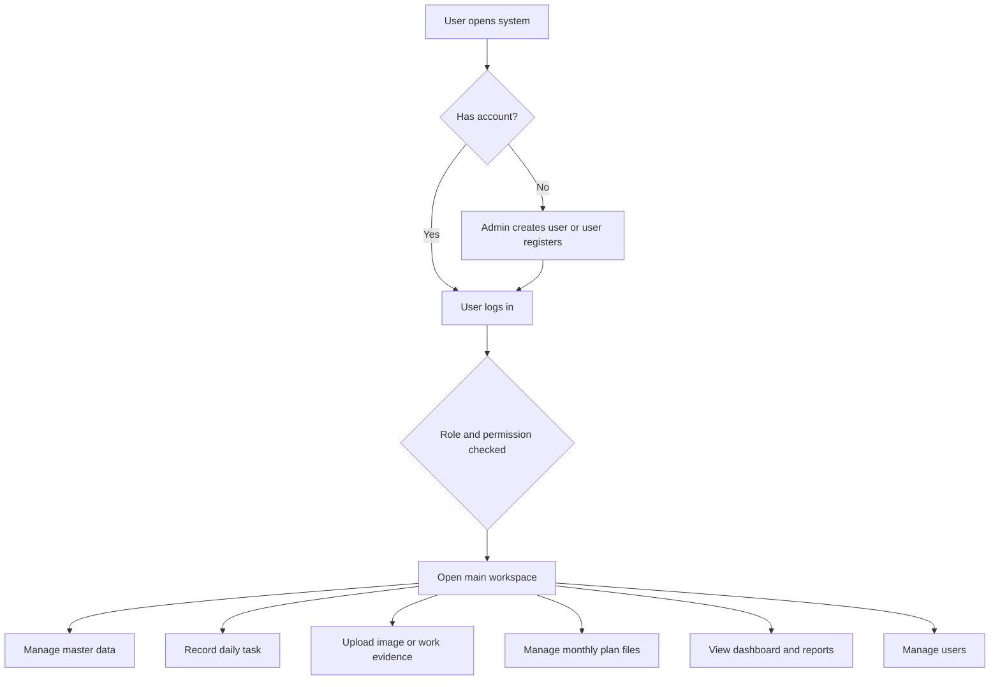
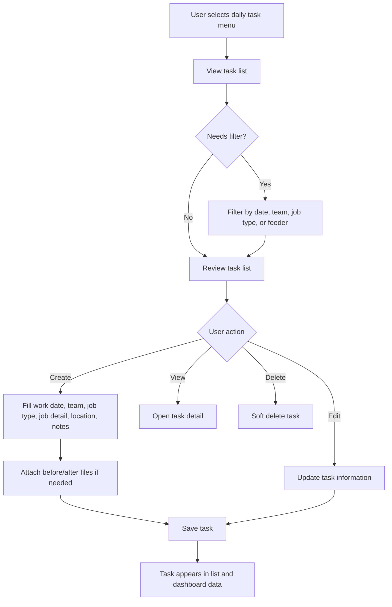
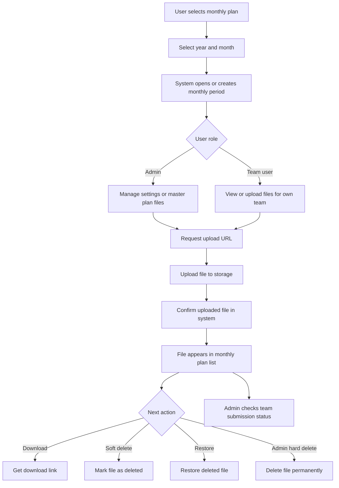
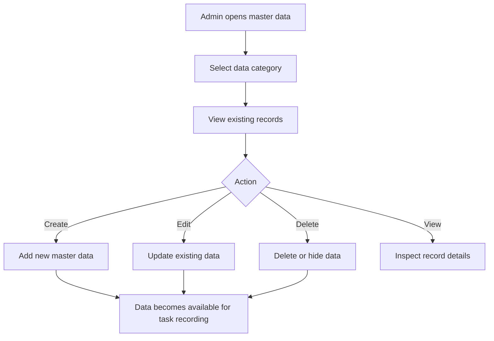
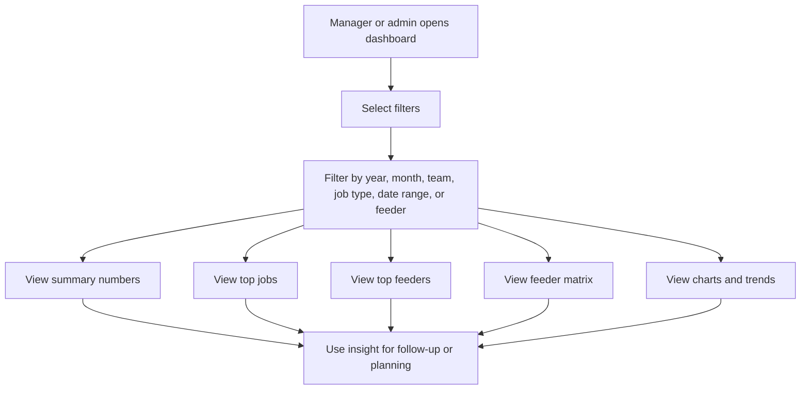
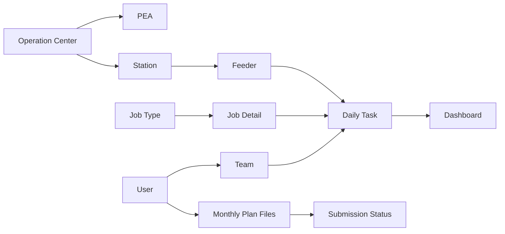

# Hotline Operations Product PRD And User Flow Draft

## Document Status

เอกสารนี้เป็น PRD ฉบับร่างจากความเข้าใจของระบบเดิมในโปรเจค `backend-hotline`

ใช้สำหรับให้ทีมตรวจสอบ แก้ไข ลบ เพิ่มเติม และยืนยัน workflow ร่วมกันก่อนทำงานรอบถัดไป

## Product Summary

ระบบนี้คือแพลตฟอร์มสำหรับจัดการงานปฏิบัติการ Hotline และงานภาคสนาม ตั้งแต่การจัดการข้อมูลพื้นฐาน การบันทึกงานรายวัน การเก็บหลักฐานประกอบงาน การจัดการไฟล์แผนรายเดือน ไปจนถึงการดูภาพรวมผ่าน Dashboard

เป้าหมายหลักคือทำให้ทีมทำงานจากข้อมูลชุดเดียวกัน ลดการกระจัดกระจายของข้อมูล และช่วยให้ผู้ดูแลระบบหรือหัวหน้าทีมเห็นสถานะงานย้อนหลังและภาพรวมการทำงานได้ง่ายขึ้น

## Product Goals

- รวมข้อมูลสำคัญของงาน Hotline ไว้ในระบบเดียว
- ทำให้การบันทึกงานรายวันเป็นมาตรฐาน
- ลดการกรอกข้อมูลซ้ำและลดความคลาดเคลื่อนจากการใช้ข้อมูลหลายแหล่ง
- ช่วยให้ทีมตรวจสอบงานย้อนหลังได้จากวันที่ ทีม สถานที่ ประเภทงาน และรายละเอียดงาน
- ช่วยให้ผู้บริหารหรือหัวหน้าทีมดูสถิติและภาพรวมการทำงานได้เร็วขึ้น
- รองรับการจัดเก็บไฟล์แผนรายเดือนและหลักฐานประกอบงาน
- ควบคุมสิทธิ์การใช้งานตามบทบาทของผู้ใช้

## Target Users

### Admin

ผู้ดูแลระบบที่สามารถจัดการข้อมูลหลัก ผู้ใช้ สิทธิ์ แผนรายเดือน และข้อมูลภาพรวมของระบบ

### Team User

ผู้ใช้งานประจำทีมที่เกี่ยวข้องกับการบันทึกงาน ดูงานที่เกี่ยวข้องกับทีม และส่งไฟล์หรือหลักฐานตามสิทธิ์ของตัวเอง

### Manager Or Supervisor

ผู้ติดตามภาพรวมการทำงาน ดูสถิติ ตรวจสอบงานย้อนหลัง และใช้ข้อมูลเพื่อวางแผนหรือประเมินการทำงานของทีม

## Product Scope

### 1. Authentication And User Access

ระบบต้องรองรับการเข้าสู่ระบบ การยืนยันตัวตน และการจำกัดสิทธิ์ตามบทบาท

สิ่งที่ระบบควรทำได้:

- สมัครหรือสร้างผู้ใช้
- เข้าสู่ระบบด้วย username และ password
- ออก access token และ refresh token
- ดูข้อมูลตัวเอง
- เปลี่ยนรหัสผ่านของตัวเอง
- จำกัดสิทธิ์ admin และผู้ใช้ทั่วไป
- ปิดการใช้งานผู้ใช้ที่ไม่ควรเข้าระบบ

### 2. Master Data Management

ระบบต้องมีข้อมูลพื้นฐานสำหรับนำไปใช้กับงานรายวันและรายงาน

ข้อมูลหลักที่ระบบดูแล:

- ทีมงาน
- ประเภทงาน
- รายละเอียดงาน
- สายป้อน
- สถานี
- การไฟฟ้าส่วนภูมิภาค
- ศูนย์ปฏิบัติการ

เป้าหมายของส่วนนี้คือทำให้ข้อมูลที่ใช้บันทึกงานเป็นชุดเดียวกันทั้งระบบ

### 3. Daily Task Management

ระบบต้องให้ผู้ใช้บันทึกงานประจำวันที่เกิดขึ้นจริงในหน้างาน

ข้อมูลของงานรายวันควรประกอบด้วย:

- วันที่ทำงาน
- ทีมที่รับผิดชอบ
- ประเภทงาน
- รายละเอียดงาน
- สายป้อนหรือพื้นที่ที่เกี่ยวข้อง
- เลขเสาหรือรหัสอุปกรณ์ ถ้ามี
- รายละเอียดเพิ่มเติม
- รูปหรือไฟล์ก่อนทำงาน
- รูปหรือไฟล์หลังทำงาน
- พิกัด ถ้ามี

ผู้ใช้ควรสามารถ:

- สร้างงานรายวัน
- ดูรายการงานทั้งหมด
- กรองงานตามวันที่ ทีม ประเภทงาน หรือสายป้อน
- ดูรายละเอียดงาน
- แก้ไขงาน
- ลบงานแบบไม่ลบถาวร
- ดูงานแบบจัดกลุ่มตามทีม

### 4. Image And File Upload

ระบบต้องรองรับการอัปโหลดรูปหรือไฟล์ประกอบงาน เพื่อให้มีหลักฐานประกอบการทำงาน

สิ่งที่ระบบควรทำได้:

- ขอ URL สำหรับอัปโหลดไฟล์
- รองรับไฟล์รูปภาพ เช่น JPG, PNG, WebP, GIF
- บันทึก URL ของไฟล์เพื่อนำไปผูกกับงาน
- ลบไฟล์เมื่อไม่ต้องการใช้งาน

### 5. Monthly Plan File Management

ระบบปัจจุบันรองรับการจัดการไฟล์แผนรายเดือนในรูปแบบเอกสารหรือไฟล์แนบ

หมายเหตุสำคัญ: ระบบส่วนนี้ในปัจจุบันเป็นการจัดการไฟล์แผนรายเดือน ไม่ใช่ระบบ calendar planning แบบระบุวันและเวลา

สิ่งที่ระบบควรทำได้:

- สร้างหรือเรียกดูรอบแผนรายเดือนตามปีและเดือน
- ตั้งค่าการทำงานของแผนรายเดือน
- อัปโหลดไฟล์แผนรายเดือน
- ยืนยันว่าอัปโหลดไฟล์สำเร็จ
- ดูไฟล์ของแต่ละเดือน
- ดาวน์โหลดไฟล์
- ลบไฟล์แบบชั่วคราว
- กู้คืนไฟล์
- ลบไฟล์ถาวรสำหรับ admin
- ดูสถานะการส่งไฟล์ของแต่ละทีม

### 6. Dashboard And Reporting

ระบบต้องช่วยให้ผู้ใช้เห็นภาพรวมและแนวโน้มของงานจากข้อมูลที่บันทึกไว้

ข้อมูลที่ Dashboard ควรแสดง:

- จำนวนงานทั้งหมด
- จำนวนประเภทงาน
- จำนวนสายป้อน
- ทีมที่มีงานมากที่สุด
- งานที่เกิดบ่อยที่สุด
- สายป้อนที่มีงานมากที่สุด
- สถิติตามวันที่ ทีม สายป้อน หรือประเภทงาน
- มุมมองความสัมพันธ์ระหว่างสายป้อนกับรายละเอียดงาน

### 7. User Management

ระบบต้องให้ admin จัดการผู้ใช้ได้อย่างปลอดภัย

สิ่งที่ admin ควรทำได้:

- ดูรายชื่อผู้ใช้
- สร้างผู้ใช้
- แก้ไขข้อมูลผู้ใช้
- เปิดหรือปิดสถานะผู้ใช้
- กำหนด role
- ผูกผู้ใช้กับทีม
- ลบผู้ใช้

## Overall User Flow

## Daily Task User Flow

## Monthly Plan File User Flow

## Master Data User Flow

## Dashboard User Flow

## Main Data Relationship

## Key Business Rules

- งานรายวันต้องมีวันที่ ทีม ประเภทงาน และรายละเอียดงาน
- งานรายวันสามารถมีสถานที่ รูปก่อนทำงาน รูปหลังทำงาน และพิกัดเพิ่มเติมได้
- การลบงานรายวันควรเป็นการลบแบบซ่อนหรือ soft delete เพื่อป้องกันข้อมูลหายถาวร
- ผู้ใช้ทั่วไปควรเห็นหรือจัดการข้อมูลตามสิทธิ์ของทีมตัวเอง
- Admin สามารถจัดการข้อมูลหลัก ผู้ใช้ และไฟล์แผนรายเดือนได้มากกว่าผู้ใช้ทั่วไป
- ไฟล์แผนรายเดือนต้องผูกกับปีและเดือน
- สถานะการส่งแผนรายเดือนควรมองเห็นได้เป็นรายทีม
- Password hash หรือข้อมูลลับของผู้ใช้ต้องไม่ถูกแสดงในระบบ

## Success Metrics

- ทีมสามารถบันทึกงานรายวันได้ครบถ้วนและค้นหาย้อนหลังได้
- Admin สามารถจัดการข้อมูลหลักได้โดยไม่ต้องแก้ข้อมูลจากฐานข้อมูลโดยตรง
- ผู้บริหารสามารถดูภาพรวมงานจาก Dashboard ได้เร็วขึ้น
- ทีมสามารถส่งไฟล์แผนรายเดือนได้เป็นระบบ
- ระบบลดการใช้ไฟล์กระจัดกระจายและลดข้อมูลซ้ำซ้อน
- ผู้ใช้แต่ละ role เห็นข้อมูลตามสิทธิ์ที่เหมาะสม

## Out Of Scope For Current System

สิ่งเหล่านี้ยังไม่ใช่ความสามารถหลักของระบบเดิมตามที่เห็นในปัจจุบัน:

- Calendar planning แบบ Google Calendar
- ระบุเวลาเริ่มและเวลาจบของงาน
- ลากวางงานบนปฏิทิน
- ตรวจสอบเวลาชนกัน
- recurring schedule
- notification หรือ reminder เต็มรูปแบบ
- approval workflow หลายชั้น
- mobile offline mode

## Items To Verify With Team

- role จริงของระบบมีแค่ admin และ user หรือมี manager/staff เพิ่มเติม
- ผู้ใช้ทั่วไปควรเห็น task ของทั้งระบบหรือเฉพาะทีมตัวเอง
- task daily คือข้อมูลหลังทำงานจริง หรือใช้เป็นแผนงานล่วงหน้าด้วย
- monthly plan file ใช้แทนเอกสารชนิดใดบ้าง
- สถานะ submitted/pending/missed ของ monthly plan ต้องคำนวณจาก deadline จริงหรือแค่มีไฟล์แล้วถือว่าส่งแล้ว
- Dashboard ต้องใช้ข้อมูลตามสิทธิ์ของผู้ใช้หรือทุกคนเห็นภาพรวมเดียวกัน
- การลบ master data ควรลบจริง ซ่อน หรือห้ามลบถ้ามี task ผูกอยู่
- รูปก่อนและหลังทำงานจำเป็นต้องมีทุก task หรือ optional
- พิกัดต้องบันทึกจากมือถืออัตโนมัติหรือให้กรอกเองได้

## Draft Conclusion

จากระบบเดิม Product นี้ควรถูกนิยามว่า:

**ระบบจัดการงาน Hotline และงานภาคสนาม ที่รวมข้อมูลพื้นฐาน การบันทึกงานรายวัน หลักฐานประกอบงาน แผนรายเดือนแบบไฟล์ และ Dashboard การติดตามผลไว้ในที่เดียว**

เอกสารนี้ยังเป็นฉบับร่างเพื่อให้ทีมใช้ verify product scope และ workflow ก่อนตัดสินใจว่าระบบเวอร์ชันถัดไปควรปรับหรือเพิ่มอะไรต่อไป
